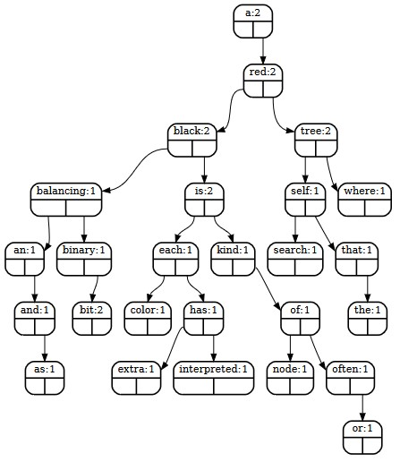
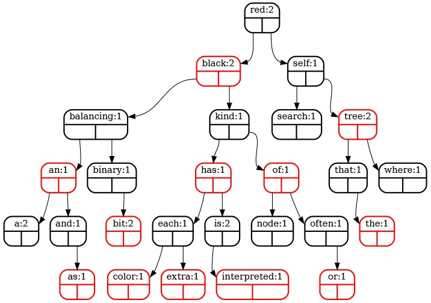

# Tree Comparison

This second year group project is an implementation of a binary and red-black tree. Its primary function is used to check the spelling of a document given a dictionary of words. There are extra functionalities that can contrast the speed between binary and red-black insertion/search or to visualise the tree structure when it is filled with words. The project was used to showcase that we knew how to code a binary tree from scratch, create insert, delete, and search functions for it and re-balance correctly if it is a red-black tree.

## How to use

### Compile:

`gcc *.c -o tree`

### Run some examples:

**Linux:**

`./tree < 1000-most-common-words.txt -c war-peace.txt`

`./tree < war-peace.txt -c 1000-most-common-words.txt`

**PowerShell:**

`Get-Content war-peace.txt | .\tree -c 1000-most-common-words.txt`

`Get-Content 1000-most-common-words.txt | .\tree -c war-peace.txt`

## Command Line Arguments
| Option        | Action performed                                                                                                                                                                                                                                    |
|---------------|-----------------------------------------------------------------------------------------------------------------------------------------------------------------------------------------------------------------------------------------------------|
| -c *filename* | Check the spelling of words in *filename* using words from stdin as the dictionary. Print all unknown words to stdout. Print timing information and unknown word count to stderr. When this option is given then the -d and -o options are ignored. |
| -d            | Only prints the depth of the tree to stdout                                                                                                                                                                                                         |
| -f *filename* | Write the "*dot*" output to *filename* instead of the default file name if -o is also given.                                                                                                                                                        |
| -o            | Outputs a representation of the tree in "*dot*" form to the file 'tree-view.dot' using the functions given in the output-dot.txt.                                                                                                                   |
| -r            | Makes the tree a red-black tree instead of the default binary search tree                                                                                                                                                                           |
| -h            | Prints a help message describing how to use the program                                                                                                                                                                                             |

## Examples

`./tree < war-peace.txt -c 1000-most-common-words.txt`

---

`./tree < test.txt -o`

`dot -Tpdf < tree-view.dot >| tree-view.pdf`

---

`./tree < test.txt -o -r`

`dot -Tpdf < tree-view.dot >| tree-view.pdf`

